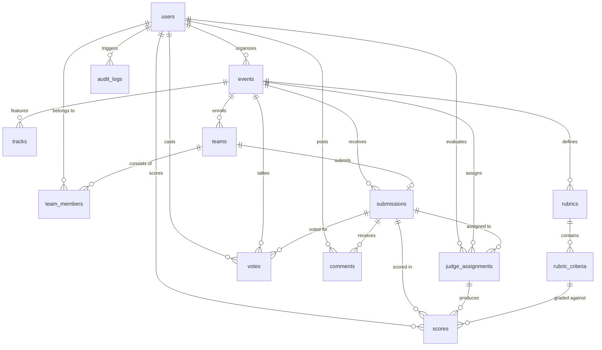

# DOGFOOD — Data Model Specification

> **PostgreSQL schema, entity relationships, integrity constraints, and migration sequencing for the DOGFOOD platform.**

---

## 1. Entity Relationship Overview

---

## 2. Table Specifications

### 1. `users`
Represents registered platform actors (participants, judges, organizers, administrators).
* `id` (UUID, PK, Default: `gen_random_uuid()`): Unique user ID.
* `username` (VARCHAR(50), UNIQUE, NOT NULL): Alphanumeric handle.
* `email` (VARCHAR(255), UNIQUE, NOT NULL): Verified email address.
* `password_hash` (VARCHAR(255), NOT NULL): Bcrypt salted hash (10 rounds).
* `role` (VARCHAR(20), NOT NULL, Default: `'PARTICIPANT'`): Check: `VISITOR`, `PARTICIPANT`, `JUDGE`, `ORGANIZER`, `ADMIN`.
* `full_name` (VARCHAR(100), NOT NULL): Display name.
* `bio` (TEXT, Nullable): Self-description.
* `avatar_url` (TEXT, Nullable): Profile image URL.
* `created_at` / `updated_at` (TIMESTAMPTZ, NOT NULL).

### 2. `events`
Represents hackathon competitions and conferences.
* `id` (UUID, PK, Default: `gen_random_uuid()`).
* `title` (VARCHAR(200), NOT NULL): Competition title.
* `slug` (VARCHAR(100), UNIQUE, NOT NULL): URL-friendly slug.
* `description` (TEXT, NOT NULL): Markdown overview.
* `start_date` (TIMESTAMPTZ, NOT NULL).
* `end_date` (TIMESTAMPTZ, NOT NULL).
* `submission_deadline` (TIMESTAMPTZ, NOT NULL).
* `status` (VARCHAR(20), NOT NULL, Default: `'draft'`): Check: `draft`, `published`, `ongoing`, `voting`, `judging`, `closed`.
* `banner_url` / `location` (TEXT / VARCHAR).
* `created_by` (UUID, FK -> `users.id`, ON DELETE RESTRICT).

### 3. `tracks`
Prize categories or thematic technical areas within a hackathon.
* `id` (UUID, PK, Default: `gen_random_uuid()`).
* `event_id` (UUID, FK -> `events.id`, ON DELETE CASCADE).
* `name` (VARCHAR(100), NOT NULL): Track title.
* `description` (TEXT, Nullable).
* `prize_pool` (VARCHAR(100), Nullable): Monetary or sponsor prizes.
* *Constraint:* `UNIQUE(event_id, name)`.

### 4. `teams`
Participant collaborations competing in an event.
* `id` (UUID, PK, Default: `gen_random_uuid()`).
* `event_id` (UUID, FK -> `events.id`, ON DELETE CASCADE).
* `name` (VARCHAR(100), NOT NULL): Team name.
* `slug` (VARCHAR(120), NOT NULL).
* `description` (TEXT, Nullable).
* `leader_id` (UUID, FK -> `users.id`, ON DELETE RESTRICT).
* `invite_code` (VARCHAR(32), UNIQUE, NOT NULL): 8-character secret invite token.
* *Constraint:* `UNIQUE(event_id, name)`.

### 5. `team_members`
Association table connecting users to teams.
* `id` (UUID, PK, Default: `gen_random_uuid()`).
* `team_id` (UUID, FK -> `teams.id`, ON DELETE CASCADE).
* `user_id` (UUID, FK -> `users.id`, ON DELETE CASCADE).
* `role` (VARCHAR(20), Default: `'member'`): Check: `leader`, `member`.
* *Constraint:* `UNIQUE(team_id, user_id)`.

### 6. `submissions`
Team project entries submitted for judging.
* `id` (UUID, PK, Default: `gen_random_uuid()`).
* `event_id` (UUID, FK -> `events.id`, ON DELETE CASCADE).
* `team_id` (UUID, FK -> `teams.id`, ON DELETE CASCADE).
* `track_id` (UUID, FK -> `tracks.id`, ON DELETE SET NULL).
* `title` (VARCHAR(200), NOT NULL).
* `tagline` (VARCHAR(255), NOT NULL): One-sentence elevator pitch.
* `description` (TEXT, NOT NULL): Full architectural breakdown.
* `repo_url` (TEXT, NOT NULL): Git repository URL.
* `demo_url` / `video_url` (TEXT, Nullable).
* `tech_stack` (TEXT[], Default: `'{}'`).
* `status` (VARCHAR(20), Default: `'draft'`): Check: `draft`, `submitted`.
* `submitted_at` (TIMESTAMPTZ, Nullable).
* *Constraint:* `UNIQUE(event_id, team_id)` (One submission per team per event).

### 7. `rubrics`
Evaluation framework attached to a hackathon.
* `id` (UUID, PK, Default: `gen_random_uuid()`).
* `event_id` (UUID, FK -> `events.id`, ON DELETE CASCADE).
* `name` (VARCHAR(100), NOT NULL).
* `max_score` (NUMERIC(5,2), Default: `100.00`).

### 8. `rubric_criteria`
Individual weighted dimensions within a rubric.
* `id` (UUID, PK, Default: `gen_random_uuid()`).
* `rubric_id` (UUID, FK -> `rubrics.id`, ON DELETE CASCADE).
* `name` (VARCHAR(100), NOT NULL).
* `description` (TEXT, Nullable).
* `weight` (NUMERIC(4,2), Default: `1.00`, Check: `weight > 0`).
* `max_points` (NUMERIC(5,2), Default: `10.00`, Check: `max_points > 0`).

### 9. `judge_assignments`
Enforces Judge Isolation (Rule 16).
* `id` (UUID, PK, Default: `gen_random_uuid()`).
* `event_id` (UUID, FK -> `events.id`, ON DELETE CASCADE).
* `judge_id` (UUID, FK -> `users.id`, ON DELETE CASCADE).
* `submission_id` (UUID, FK -> `submissions.id`, ON DELETE CASCADE).
* `status` (VARCHAR(20), Default: `'assigned'`): Check: `assigned`, `in_progress`, `completed`.
* *Constraint:* `UNIQUE(judge_id, submission_id)`.

### 10. `scores`
Judges' evaluations for each rubric criterion.
* `id` (UUID, PK, Default: `gen_random_uuid()`).
* `assignment_id` (UUID, FK -> `judge_assignments.id`, ON DELETE CASCADE).
* `judge_id` (UUID, FK -> `users.id`, ON DELETE CASCADE).
* `submission_id` (UUID, FK -> `submissions.id`, ON DELETE CASCADE).
* `criterion_id` (UUID, FK -> `rubric_criteria.id`, ON DELETE CASCADE).
* `points` (NUMERIC(5,2), NOT NULL, Check: `points >= 0`).
* `feedback` (TEXT, Nullable).
* *Constraint:* `UNIQUE(judge_id, submission_id, criterion_id)`.

### 11. `votes`
Community Choice voting records.
* `id` (UUID, PK, Default: `gen_random_uuid()`).
* `event_id` (UUID, FK -> `events.id`, ON DELETE CASCADE).
* `user_id` (UUID, FK -> `users.id`, ON DELETE CASCADE).
* `submission_id` (UUID, FK -> `submissions.id`, ON DELETE CASCADE).
* *Constraint:* `UNIQUE(event_id, user_id)` (One vote per user per event).

### 12. `comments`
Public discussion and internal evaluation notes on submissions.
* `id` (UUID, PK, Default: `gen_random_uuid()`).
* `submission_id` (UUID, FK -> `submissions.id`, ON DELETE CASCADE).
* `user_id` (UUID, FK -> `users.id`, ON DELETE CASCADE).
* `content` (TEXT, NOT NULL).
* `is_internal` (BOOLEAN, Default: `FALSE`): When true, restricted to judges/organizers.

### 13. `audit_logs`
Immutable compliance and security records (Rule 23).
* `id` (UUID, PK, Default: `gen_random_uuid()`).
* `user_id` (UUID, FK -> `users.id`, ON DELETE SET NULL).
* `action` (VARCHAR(50), NOT NULL).
* `entity_type` (VARCHAR(50), NOT NULL).
* `entity_id` (VARCHAR(100), Nullable).
* `details` (JSONB, Default: `'{}'::jsonb`).
* `ip_address` / `user_agent` (VARCHAR(45) / TEXT).
* `created_at` (TIMESTAMPTZ, Default: `CURRENT_TIMESTAMP`).
